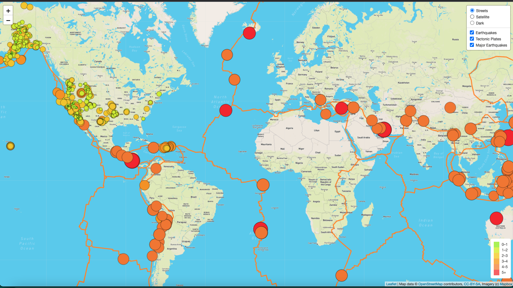

## Mapping_Earthquakes

### Overview:The purpose of this project is to visually show the differences between the magnitudes of earthquakes all over the world for the last seven days.To complete this project, we use a URL for GeoJSON earthquake data from the USGS website and using JavaScript and the D3.js library we retrieve the coordinates and magnitudes of the earthquakes for the last seven days. 
### We then use the Leaflet library to plot the data on a Mapbox map through an API request and create interactivity for the earthquake data.

### Purpose: We created the earthquake map with two different maps and the earthquake overlay. For the challenge we are would like to see the earthquake data in relation to the tectonic plates’ location on the earth, and all the earthquakes with a magnitude greater than 4.5 on the map, and see the data on a third map.

